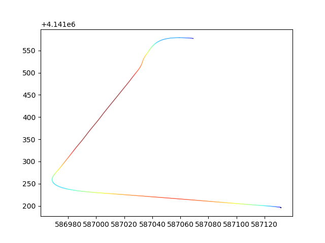

# ipath
apollo path and simple map making tool

## Install
You can install `ipath` by below cmd.
```shell
pip3 install ipath
```

## Draw path
Then we can use below cmd to draw path from cyber_record
```
cyber_record echo -f example.record.00000 -t /apollo/localization/pose | ipath
```



#### Color
The color represents the magnitude of the value, with blue representing smaller values and red representing higher values.

For now we support
- velocity
- acceleration
The localization uncertainty values will be supported later.

You can use the following options to display the line color
```
ipath -d=v  // velocity
ipath -d=a  // acceleration
```

#### Save path
Since it is time-consuming to read the location information from the record file, we can save it to file add `-s`, which is saved to the local `path.txt ` by default.
```
cyber_record echo -f example.record.00000 -t /apollo/localization/pose | ipath -s
```

## Draw from file
After saving path.txt you can read directly from it and draw the path.
```
ipath -i path.txt
```
